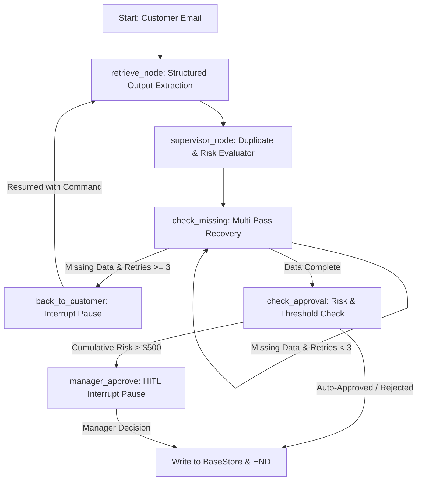

# Enterprise Claims Agent: Stateful Multi-Agent Support Architecture

A production-ready, fault-tolerant support ticket automation engine built with **LangGraph**, **Ollama (Llama 3.2)**, and **Pydantic**. Features cross-thread memory, Human-in-the-Loop (HITL) execution pauses, and cumulative risk-governance checks.

## Architecture Flow

	
##Key Technical FeaturesStateful Human-in-the-Loop (HITL): 
* Uses native LangGraph interrupt() and Command(resume=...) to freeze execution and wait for asynchronous customer or manager input without thread loss.
* Cross-Session BaseStore Memory: Maintains transactional state across distinct execution threads (thread_id) to automatically block duplicate order claims (ORD-XXX) and enforce cumulative monetary risk limits ($500 cap per customer).
* Defensive Extraction & Multi-Pass Recovery: Utilizes structured Pydantic schema validation for local model (Llama 3.2) output parsing, backed by a 2-pass fallback recovery mechanism (LLM retry $\rightarrow$ BaseStore key-value lookup).
	
Quickstart

Bash
# Setup Virtual Environment
python -m venv .venv
source .venv/bin/activate  # On Windows: .venv\Scripts\activate

# Install Dependencies
pip install langgraph langchain-ollama pydantic

# Ensure Ollama is running Llama 3.2 locally
ollama run llama3.2

# Execute Test Suite
python main.py